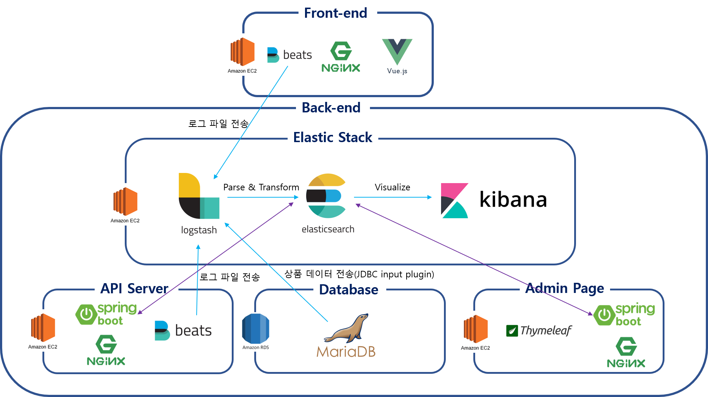
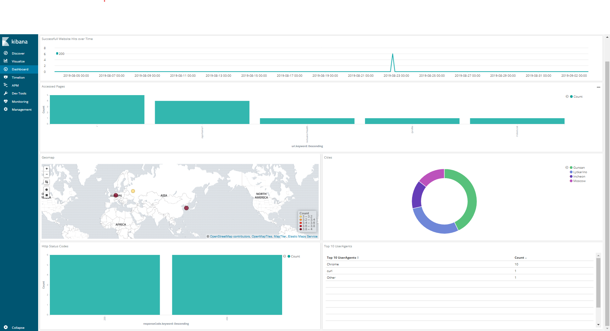
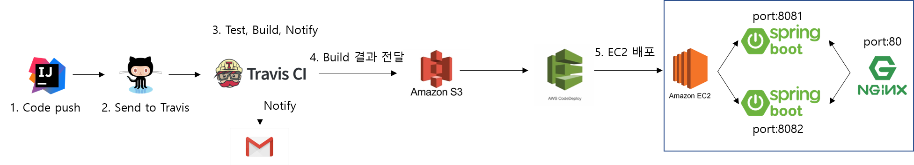

# Toy Project: Spring Boot와 Vue.js를 이용한 도서 쇼핑몰 
처음 다뤄보는 기술 스택(Vue.js, JPA, Elastic Stack, AWS ···)들을 사용하여 만든 관리자-사용자 기반의 도서 쇼핑몰

[클라이언트](https://github.com/khj2872/Bookshop_Front)

API 서버(현재 페이지)
 
[관리자 페이지](https://github.com/khj2872/Bookshop_admin)

## 목표
1. 프로젝트는 크게 API 서버, 클라이언트, 관리자 페이지로 구성한다.
2. API 서버와 관리자 페이지는 코드가 서로 교차 사용될 확률이 높기 때문에 분리해서 구현한다.
3. Spring Boot, Spring Data JPA·Elasticsearch 로 API 서버와 관리자 페이지를 구성한다.
4. 클라이언트단은 Vue.js를 활용하여 제작한다.
5. 관리자페이지는 Thymeleaf 템플릿 엔진을 이용한 SSR로 제작한다.
6. 완성된 프로젝트를 AWS EC2에 배포한다.
7. 6번까지의 과정이 끝나면 Travis-CI와 AWS S3, CodeDeploy를 자동 배포 시스템을 구축한다.
8. Nginx를 이용하여 Blue-Green 무중단 배포 시스템을 구축한다.
9. Elastic Stack을 이용해 Nginx의 Access-log를 분석한다.
10. 여러가지 기술 스택들을 경험해보는 것이 최종 목표이다.

## 주제
관리자-사용자 기반의 기본적인 기능들이 구현된 쇼핑몰을 구현한다.

## 구현
### API 서버
#### 사용기술
- Spring Boot 2.1
- Spring Data JPA(Hibernate)
- Spring Data Elasticsearch
- Ehcache
- H2 Database
- MySQL
- JWT
- Querydsl
- OAuth2 login

#### 제작 내용
- 소셜 로그인 기반 회원제 쇼핑몰 제작을 목표로 한다.
- JWT를 사용하여 사용자 인증을 진행한다.
- 장바구니, 결제, 상품 리플, 결제목록 등의 쇼핑몰의 기본적인 기능을 구현한다.
- HTTP API(REST)로 서버와 클라이언트가 JSON 데이터를 주고 받는다.
- Elasticsearch를 이용하여 검색어 자동완성 및 검색 기능을 구현한다.
- Ehcache를 이용하여 카테고리 목록, 메인페이지 상품 목록등을 캐싱처리한다.
- 동적쿼리를 사용해야 하는 부분은 JPQL 대신 Querydsl을 이용한다.

### Vue.js 클라이언트
View를 작성하는데 이용되는 자바스크립트 기술의 이해를 위해 상대적으로 진입장벽이 낮은 Vue.js를 이용한다.

최신 자바스크립트 기술(ES6, babel, webpack)의 이해를 위해 구현과정 중 이를 사용해본다.

#### Vue.js Client 사용 기술
- vue-cli: 프로젝트 스캐폴딩
- vue.js 2.6, vue-cli 3.5
- vuex: 상태관리
- vue-router: SPA 라우팅
- axios: HTTP client
- Bootstrap

#### Client 제작 내용
- Page Reloading이 없는 SPA를 목표로 한다.
- ES6 문법을 사용하여 작성하고 babel로 크로스 컴파일 하며, webpack으로 번들링한다.
- vuex를 사용하여 상태관리를 한다.
- vue-router로 새로고침 없이 리소스 경로 관리를 한다.
- axios를 이용하여 서버와 HTTP 통신을 한다.

### 관리자 페이지
#### 서버
##### 서버 사용기술
- Spring Boot 2.1
- Spring Data JPA(Hibernate)
- Spring Data Elasticsearch
- Spring Security
- H2 Database
- MySQL
- Querydsl

##### 서버 제작 내용
- Spring Security를 통해 세션기반 로그인, 비밀번호 암호화등을 적용한다.
- 카테고리, 상품, 주문 관리 등의 관리자 페이지의 기본적인 기능을 구현한다.
- 동적쿼리를 사용해야 하는 부분은 JPQL 대신 Querydsl을 이용한다.
- HTTP API(REST)로 서버와 클라이언트가 JSON 데이터를 주고 받는다.

#### Thymeleaf 템플릿 엔진
템플릿 엔진으로 기존에 사용해봤던 JSP 이외의 후보에서 선택한 Thymeleaf를 사용한다.

##### Thymeleaf 템플릿 엔진 사용 기술
- Thymeleaf(Spring-boot-starter)
- Bootstrap
- JQuery

## 배포 환경
### AWS 배포 전체 구조

#### Elastic Stack

Elastic Stack(Filebeat-Logstash-Elasticsearch-Kibana)를 이용하여 API Server의 Nginx Access-log를 분석한다.

### 무중단 배포 구조

#### Travis-CI
Git push를 하면 Travis-CI에서 Test와 Build를 시작한다. 성공 시 결과물을 AWS S3에 업로드 한다.

#### AWS CodeDeploy
S3에 업로드 된 Build 결과물을 EC2에 전달한다. 기존 소스코드를 덮어쓰고, 실패할 경우 자동으로 롤백시킨다.

#### EC2
Nginx를 리버스 프록시 서버로 사용하여 2개의 Spring Boot 인스턴스로 Blue-Green 무중단 배포를 구현한다.